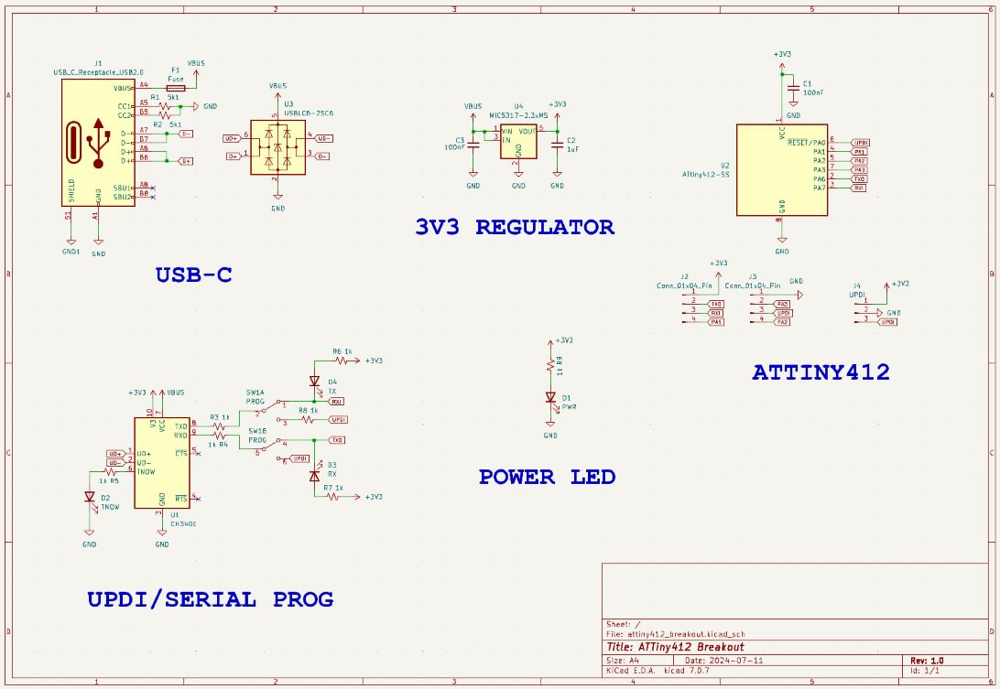
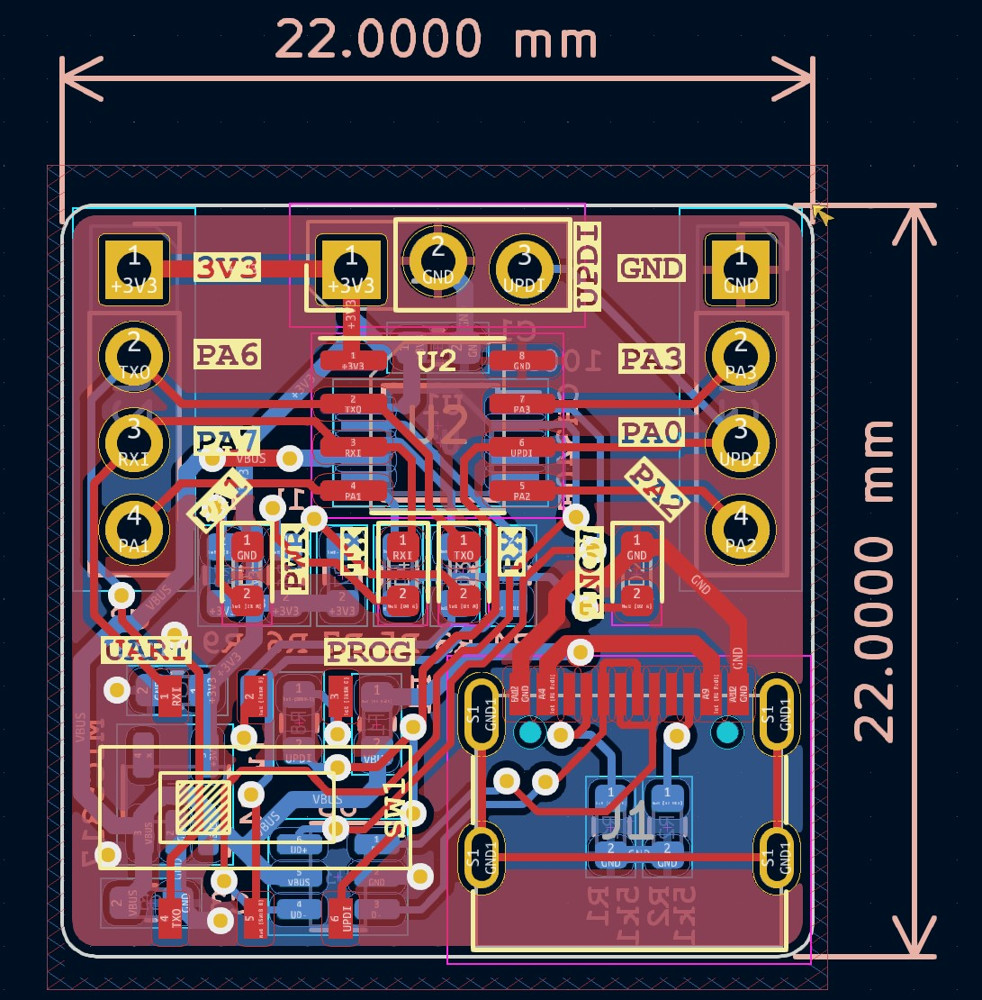
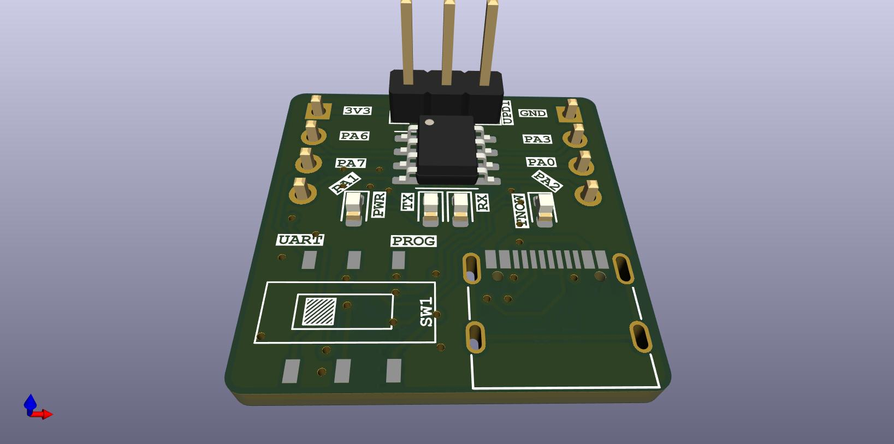

# ATTiny412-Breakout
Simple breakout for the ATTiny412 using USB for uploading and serial comms

This board is a simple breakout for the ATTiny412.  This allows for programming and UART serial communications through a USB interface.  Included in breakout is a power led indication, and a few feedback LEDs for UART and UPDI programming.  UPDI and UART need to be selected via switch on the front of the breakout.

## Purpose
I wanted a way to quickly and easily test some software with the attiny412 (or similar avr chip), and not have to have a programmer and separate power source connected to chip.  This usually involved using a USB connector for power (sometimes doubling as a serial comms port) and some UPDI programmer to upload code.  This board will hopefully just allow me to use the USB for all functionality and to make development a little be cleaner and easier. 

## Scematic

## Layout

## 3D Render

## Current State of Affairs
### Version 1
* Populate and test board
* Fix the inevitable issue that I missed during production